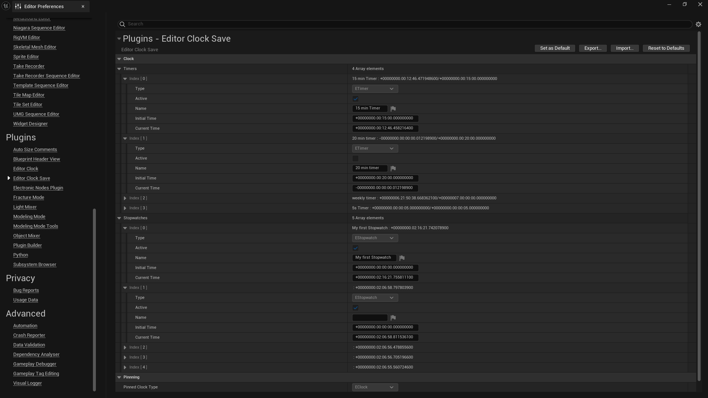

# Editor Clock Save
Clocks (Timers & Stopwatches) are saved in a Config file called `EditorClockSave.ini` in `[Plugins]/EditorClock/Config/` folder.  
It is also available through the Editor in `Editor Preferences -> Plugins -> Editor Clock Save`.

## Editing a Timer
### In Engine
1. Open `Editor Preferences -> Plugins -> Editor Clock Save`
2. Find the Timer you want to edit in the `Timers` Array.
3. Through the Editor you can edit the `Name`, `Initial Time` and the `Current Time` of the Timer.
4. Editing the `Name` will only be applied after restarting the Editor.
### Outside Engine
1. Open `EditorClockSave.ini` file `[Plugins]/EditorClock/Config/` folder