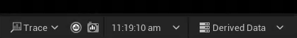
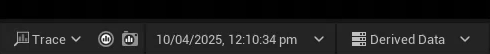
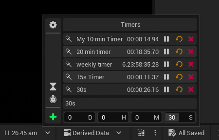
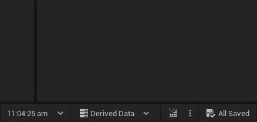
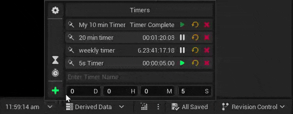
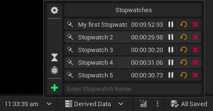
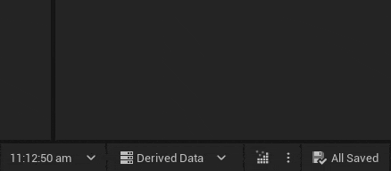
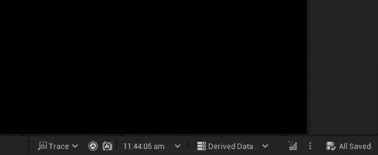

# Installation
1. Open Epic Games Launcher and navigate to **Unreal Engine → Library → Vault**
2. Search for **Editor Clock**
3. Click Install to Engine and select the engine version you want to install the plugin to
4. Wait for the plugin to be downloaded and installed
5. Open your project and navigate to **Edit → Plugins**
6. Search for Editor Clock
7. Enable the Editor Clock Plugin and Restart the Editor

# Features
## Clock
By default the plugin adds a Clock Widget to the Editor Status Bar that display your Current Local Time.

### Clock Display Format
Customize Clock Display Format in Editor Clock Settings  
 `d MM YYY h mm s a`
 `d MMMM YYY h mm s a`

### Editor Clock Lite
if you only want the Clock and not the other features, check out the much cheaper [Editor Clock Lite Plugin](/plugins/editorclocklite/) instead.

## Timers
Create and manage multiple timers right in the editor.

### Create new Timer
Creating a new Timer is as simple as setting the Duration, Name (optional) and clicking the + Button

### Timer Notification
Get a notification when Timer Finishes.

## Stopwatches
Create and manage multiple stopwatches right in the editor

### Create new Stopwatch
Creating a new Stopwatch is as simple as setting the Name (optional) and clicking the + Button

## Pinning
You can Pin Timers or Stopwatches to the Status Bar instead of the Clock. Unpin to get the Clock back.
