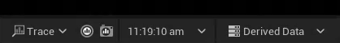
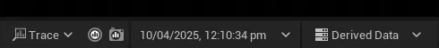
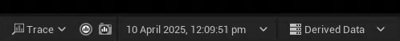

# Installation
1. Open Epic Games Launcher and navigate to **Unreal Engine → Library → Vault**
2. Search for **Editor Clock Lite**
3. Click Install to Engine and select the engine version you want to install the plugin to dsd sd sd asd asd asd asd as dasd asd ad as das dd 
4. Wait for the plugin to be downloaded and installed
5. Open your project and navigate to **Edit → Plugins**
6. Search for Editor Clock Lite
7. Enable the Editor Clock Lite Plugin and Restart the Editor

# Features
## Clock
Adds a Clock Widget to the Editor Status Bar that display your Current Local Time by default.

### Clock Display Format
Customize Clock Display Format in Editor Clock Settings  
 `d MM YYY h mm s a`
 `d MMMM YYY h mm s a`

### Editor Clock
if you need more features like Timers and Stopwatches, check out the [Editor Clock Plugin](/plugins/editorclock/) instead.