## Initialize Extrone UI Manager
Initialize ExtroneUIManager Subsystem

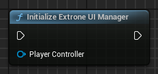

|In|Description|
|--|-----------|
|PlayerController|Player Controller that should own all the   Layers and Screens Created by Extrone UI Manager|

## Push Screen To Layer
Creates and pushes provided screen class to selected Layer

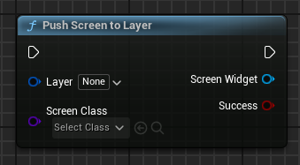

|In|Description|
|--|-----------|
|Layer|Layer to which the Screen should be pushed to|
|ScreenClass|Widget Class that should be created and pushed to Layer|

|Out|Description|
|---|-----------|
|ScreenWidget|Widget that was created and pushed to the Layer|
|bSuccess|True if ScreenWidget was successfully pushed to Layer|

## Push Screen Widget To Layer
Pushes provided Screen to selected Layer

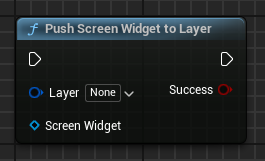

|In|Description|
|--|-----------|
|Layer|Layer to which the Screen should be pushed to|
|ScreenWidget|Widget that should be pushed to Layer|

|Out|Description|
|---|-----------|
|bSuccess|True if ScreenWidget was successfully pushed to Layer|

## Pop Screen
Pops the provided Screen from its layer if it's the Top Screen on that Layer

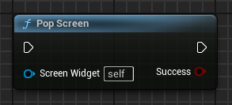

|In|Description|
|--|-----------|
|ScreenWidget|Widget that should be popped from its Layer   (Automatically set to Self if parent class is UExtroneScreenBase)|

|Out|Description|
|---|-----------|
|bSuccess|True if the Screen was popped successfully|

## Pop Top Screen From Layer
Pop the Top Screen from provided Layer 

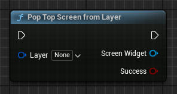

|In|Description|
|--|-----------|
|Layer|Layer from which it's top Screen should be popped|

|Out|Description|
|---|-----------|
|ScreenWidget|Widget that should be popped, if it's the Top Screen of the Layer|
|bSuccess|True if the Top Layer was popped successfully|

## Clear UI Layer
Remove all Screens from provided Layer

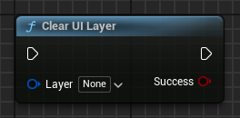

|In|Description|
|--|-----------|
|Layer|Layer that should be cleared|

|Out|Description|
|---|-----------|
|bSuccess|True if the Layer was cleared successfully|

## Get Top Screen On Layer
Get the Top Screen from selected Layer if it has any Screens

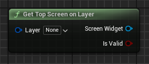

|In|Description|
|--|-----------|
|Layer|Layer from which to get the Top Screen from|

|Out|Description|
|---|-----------|
|ScreenWidget|Top Screen Widget of Layer if it had any screens|
|bIsValid|True if ScreenWidget is valid|

## Register UI Layer
Create and Register new Layer with provided Widget Class

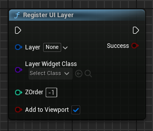

|In|Description|
|--|-----------|
|Layer|GameplayTag that should be used to Identify this Layer|
|LayerWidgetClass|Base Widget that the screens will be pushed to|
|ZOrder|ZOrder of the Layer|

|Out|Description|
|---|-----------|
|bSuccess|True if new Layer was registered successfully|

## Register UI Layer Widget
Register new Layer with provided Widget

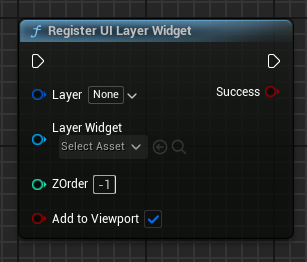

|In|Description|
|--|-----------|
|Layer|GameplayTag that should be used to Identify this Layer|
|LayerWidget|Base Widget that the screens will be pushed to|
|ZOrder|ZOrder of the Layer|

|Out|Description|
|---|-----------|
|bSuccess|True if new Layer was registered successfully|

## UnRegister UI Layer
Unregister provided Layer

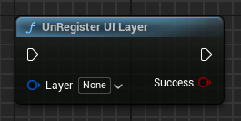

|In|Description|
|--|-----------|
|Layer|that should be Unregistered|

|Out|Description|
|---|-----------|
|bSuccess|True if the Layer was Unregistered successfully|

## Set UI Layer Visibility
Set Visibility of provided Layer

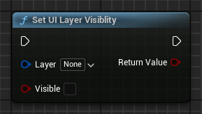

|In|Description|
|--|-----------|
|Layer|Layer that's visibility that should be set|
|bVisible|Shows the widget if true otherwise hides it|

## Hide All UI Layers
Hides all UI Layers

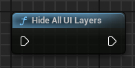

## Show All UI Layers
Shows all UI Layers

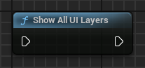

## Is UI Layer Empty
Returns true if the selected Layer doesn't have any Screens

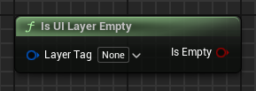

|In|Description|
|--|-----------|
|LayerTag|Layer that should be checked|

|Out|Description|
|---|-----------|
|bIsEmpty|True if the selected Layer doesn't have any Screens|

## Is Valid UI Layer
Returns true if selected Layer is registered

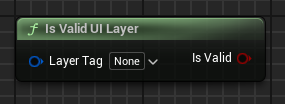

|In|Description|
|--|-----------|
|LayerTag|Layer that should be checked|

|Out|Description|
|---|-----------|
|bIsValid|True if selected Layer is registered|

## Get UI Layer Widget
Get the Widget that was registered to this Layer

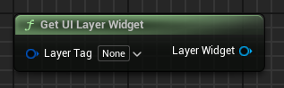

|In|Description|
|--|-----------|
|LayerTag|Layer from which to get its widget|

|Out|Description|
|---|-----------|
|LayerWidget|LayerWidget that was registered to Layer|