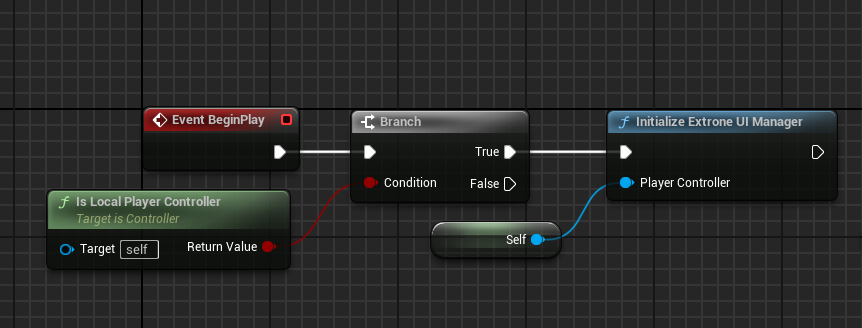
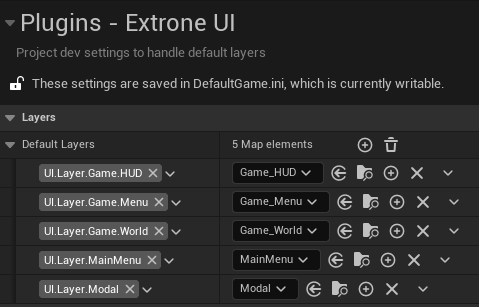
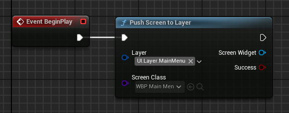
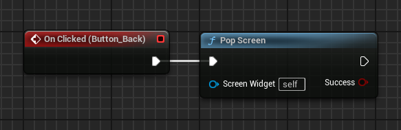

## Installing the Plugin

1. Open Epic Games Launcher and navigate to **Unreal Engine → Library → Vault**
2. Search for **Extrone UI Manager**
3. Click Install to Engine and select the engine version you want to install the plugin to
4. Wait for the plugin to be downloaded and installed
5. Open your project and navigate to **Edit → Plugins**
6. Search for Extrone UI Manager
7. Enable Extrone UI Manager and Restart the Editor

## Initializing UI Manager Subsystem

Initialize Extrone UI Manager to Assign an Owning Player Controller to widgets created by the Manager and Auto Register Default Layers

## Registering Layers

Default Layers specified in the Project Settings will be auto registered when initializing Extrone UI Manager

## Pushing Screens

Use **Push Screen to Layer** node to add widgets to layers

## Popping Screens

Use Pop Screen node to remove a widget if its currently the top screen of any layer

