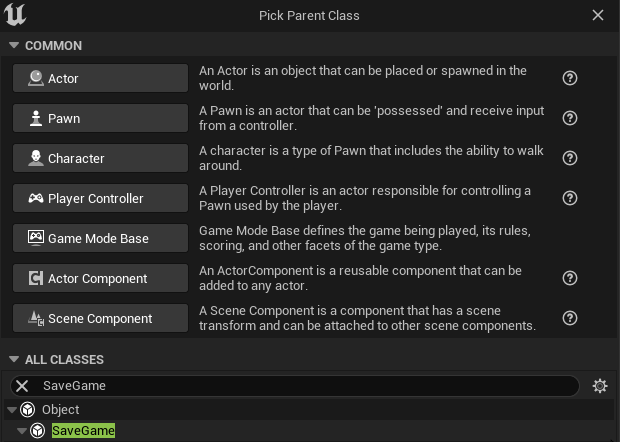
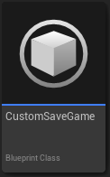
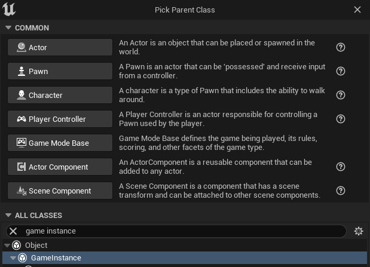
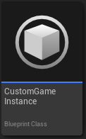
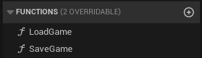
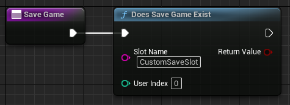
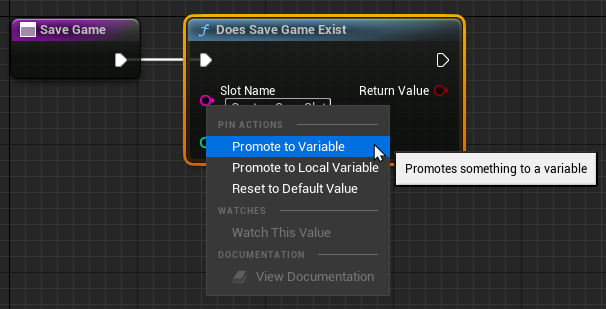
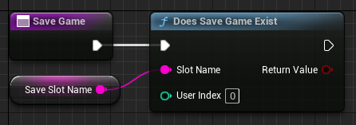

# Save Game Object

Let's start by creating a Save Game Object that'll hold all the variables we want to save.

- Right click on the Content Browser, select **Blueprint Class**, expand **All Classes** and search for **SaveGame** and select it.
   
- Give it an appropriate name, I called it CustomSaveGame.
   

You can open it and create all the variables that you want to save.

# Game Instance

Now we need something that manages all the saving and loading. A GameInstance is the perfect place for it since it's persistent from start to end play.

- Right click on the Content Browser and select Blueprint Class, expand All Classes and search for GameInstance and select it.
   
- I named it CustomGameInstance.
   
- Open it.

## Save and Load

Now wee need to create the functions that'll do the saving and loading.

- Let's create 2 functions by clicking on the + button in the functions tab, Call them SaveGame and LoadGame.
 

Inside the SaveGame function, we need to check if there is a Save File that already exists to determine if we need to create a new one or just overwrite it.

- Right click on the graph and search for Does Save Game Exist node and add it the graph.
- Connect it to the Execution pin, and enter an appropriate name in SlotName, I used "CustomSaveSlot".
  
- Now, right click the SaveSlot pin and select Promote to Variable and name it SaveSlotName. 
  
  
  This way we won't cause any unwanted issues by misspelling the slot name on other nodes.